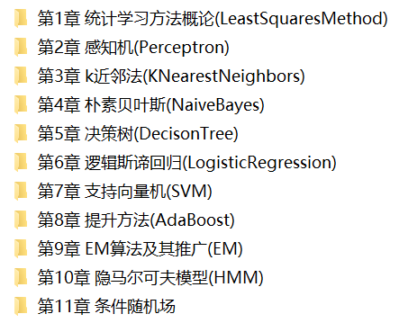

《**统计学习方法**》可以说是机器学习的入门宝典，许多机器学习培训班、互联网企业的面试、笔试题目，很多都参考这本书。本站根据网上资料用**Python**复现了课程内容，并提供本书的代码实现、课件下载。

**《统计学习方法》**，作者李航，本书全面系统地介绍了统计学习的主要方法，特别是监督学习方法，包括感知机、k近邻法、朴素贝叶斯法、决策树、逻辑斯谛回归与支持向量机、提升方法、EM算法、隐马尔可夫模型和条件随机场等。除第1章概论和最后一章总结外，每章介绍一种方法。叙述从具体问题或实例入手，由浅入深，阐明思路，给出必要的数学推导，便于读者掌握统计学习方法的实质，学会运用。

**目录:**

第1章 统计学习方法概论

第2章 感知机

第3章 k近邻法

第4章 朴素贝叶斯

第5章 决策树

第6章 逻辑斯谛回归

第7章 支持向量机

第8章 提升方法

第9章 EM算法及其推广

第10章 隐马尔可夫模型

第11章 条件随机场

第12章 统计学习方法总结

**1.统计学习方法的代码实现（code文件夹）**

**《统计学习方法》**官方没有提供代码实现，但是网上有许多机器学习爱好者尝试对每一章的内容进行了代码实现。  本站在github网站搜集了一些代码进行整理，并作了一定的修改，使用**Python3.6**实现了第1-11章的课程代码。

**代码目录与截图：**

**2.《统计学习方法》课件（ppt文件夹）**

作者袁春： 清华大学深圳研究生院，提供了全书12章的PPT课件。

**参考**  

[https://github.com/wzyonggege/statistical-learning-method](http://link.zhihu.com/?target=https%3A//github.com/wzyonggege/statistical-learning-method)

[https://github.com/WenDesi/lihang_book_algorithm](http://link.zhihu.com/?target=https%3A//github.com/WenDesi/lihang_book_algorithm)

[https://blog.csdn.net/tudaodiaozhale](http://link.zhihu.com/?target=https%3A//blog.csdn.net/tudaodiaozhale)

代码整理和修改：机器学习初学者   （微信公众号，ID:ai-start-com），qq群：554839127。

[我的知乎](https://www.zhihu.com/people/fengdu78)