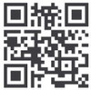

# 《统计学习方法》第二版的代码实现

李航老师编写的《统计学习方法》全面系统地介绍了统计学习的主要方法，特别是监督学习方法，包括感知机、k近邻法、朴素贝叶斯法、决策树、逻辑斯谛回归与支持向量机、提升方法、em算法、隐马尔可夫模型和条件随机场等。除第1章概论和最后一章总结外，每章介绍一种方法。叙述从具体问题或实例入手，由浅入深，阐明思路，给出必要的数学推导，便于读者掌握统计学习方法的实质，学会运用。

《统计学习方法》可以说是机器学习的入门宝典，许多机器学习培训班、互联网企业的面试、笔试题目，很多都参考这本书。 

今天我们将李航老师的《统计学习方法》第二版的代码进行了整理，并提供下载。

非常感谢各位朋友贡献的自己的笔记、代码！

2020年6月7日

## 代码目录 

第1章 统计学习方法概论

第2章 感知机

第3章 k近邻法

第4章 朴素贝叶斯

第5章 决策树

第6章 逻辑斯谛回归

第7章 支持向量机

第8章 提升方法

第9章 EM算法及其推广

第10章 隐马尔可夫模型

第11章 条件随机场

第12章 监督学习方法总结

第13章 无监督学习概论

第14章 聚类方法

第15章 奇异值分解

第16章 主成分分析

第17章 潜在语义分析

第18章 概率潜在语义分析

第19章 马尔可夫链蒙特卡洛法

第20章 潜在狄利克雷分配

第21章 PageRank算法

第22章 无监督学习方法总结

## 参考

https://github.com/wzyonggege/statistical-learning-method

https://github.com/WenDesi/lihang_book_algorithm

https://blog.csdn.net/tudaodiaozhale

https://github.com/hktxt/Learn-Statistical-Learning-Method

代码整理和修改：机器学习初学者（公众号） 

知识星球：黄博的机器学习圈子

[知乎](https://www.zhihu.com/people/fengdu78)